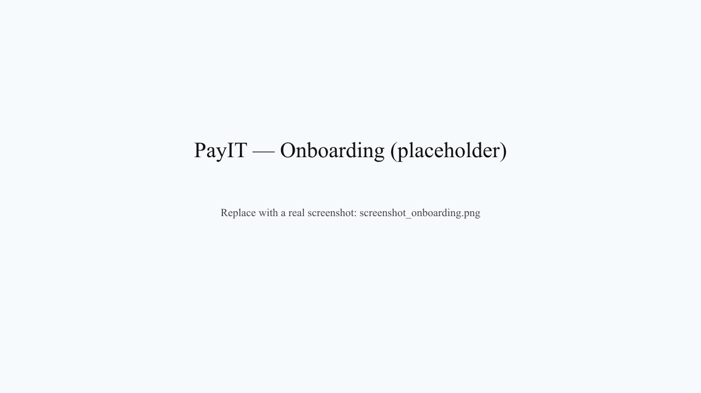
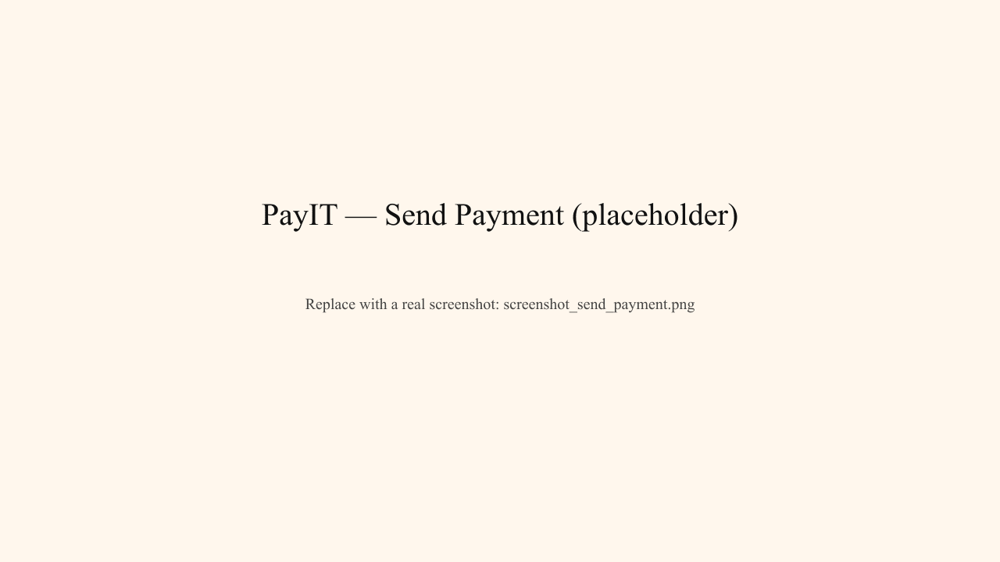
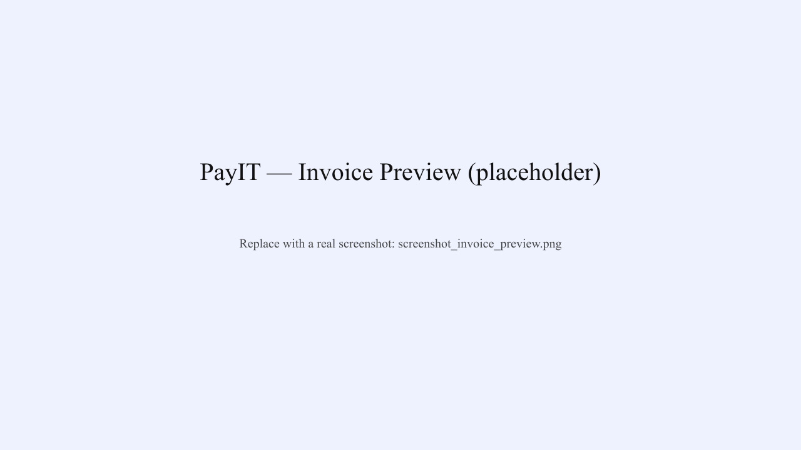

# PayIT — Telegram Wallet for Local Fiat Operations on Stablecoins

**A non-custodial Telegram bot that lets people and business owners transact in local fiat while holding their wealth in USD Coin (USDC) and Euro Coin (EURC), powered by AI-driven payment processing.**

> **Vision:** Bridge the gap between stablecoin wealth and local currency transactions. Hold dollars, spend in pesos. Issue invoices in pesos, get paid in USDC. No middleman. No currency conversion fees for transfers.

---

## Table of Contents

- [Core Vision](#core-vision)
- [Key Features](#key-features)
- [How It Works](#how-it-works)
- [Architecture](#architecture)
- [Tech Stack](#tech-stack)
- [Quick Start](#quick-start)
- [Project Structure](#project-structure)
- [Core Modules](#core-modules)
- [Multimodal AI Agent](#multimodal-ai-agent)
- [Configuration](#configuration)
- [ON/OFF-Ramp Strategy](#onoff-ramp-strategy)
- [Bot Commands](#bot-commands)
- [Security & Non-Custodial Design](#security--non-custodial-design)
- [Arc Testnet Details](#arc-testnet-details)
- [Deployment](#deployment)
- [Feature Status](#feature-status)
- [Contributing](#contributing)

---

## Core Vision

**PayIT** enables a new economic model:

```
Traditional Flow:
User earns in local currency
   ↓
Holds in local bank (0-2% APY, unstable)
   ↓
Converts to safe currency for savings (expensive, risky)

PayIT Flow:
User earns in local currency
   ↓
Receives payment in USDC via PayIT (instant, borderless)
   ↓
Holds in personal, non-custodial wallet on Arc
   ↓
Spends in local fiat via ON/OFF ramps (seamless conversion)
   ↓
Issues invoices in local currency, gets paid in USDC
   ↓
Business owners track cash flow, payroll, expenses in their timezone
```

### The Problem

- 🌍 **Billions without stable wealth storage** — local currencies erode value
- 📱 **No native access to stablecoins** — require crypto exchanges, KYC, fees
- 💼 **SMEs using primitive tools** — spreadsheets for invoicing, manual payout tracking
- 🔗 **Walled gardens** — funds locked in custodial exchanges
- 💸 **ON/OFF ramps expensive** — 2-8% fees per conversion

### The Solution

- ✅ **Non-custodial** — users control their own wallets, no hidden master key
- ✅ **Telegram-native** — no app installation, runs where users already chat
- ✅ **Multimodal input** — voice, text, photos, PDFs, spreadsheets, PPTX
- ✅ **AI-powered intent** — understand "send 5000 pesos to Maria" as easily as "0x7234..."
- ✅ **Local FX integration** — seamless ON/OFF ramps via verified payment partners
- ✅ **Business features** — invoicing, payroll, expense tracking, cash flow
- ✅ **Zero intermediaries** — peer-to-peer, peer-to-business

---

## Key Features

### 💰 Stablecoin Holdings on Arc

- **USDC** (native gas, 1:1 USD)
- **EURC** (Euro Coin, 1:1 EUR)
- Real-time FX rates via DeFiLlama
- Non-custodial private key encryption (AES-256-GCM + scrypt KDF)

### 🔄 ON/OFF-Ramps (Testnet Limited)

**Planned for mainnet Arc launch:**

- 📥 **OFF-Ramp** — Convert USDC → Local Currency (NGN, KES, GHS, etc.) via payment partner
- 📤 **ON-Ramp** — Convert Local Currency → USDC via payment partner
- 🏦 **Payment Providers** — Integrated with local FX aggregators (e.g., Wise-like partners, mobile money networks)
- ⚡ **Instant settlement** — USDC lands in user's Arc wallet within seconds

**Current Status:** 
- Testnet only (no real money flows)
- `src/offramp.js` (Paj Cash blueprint) + `src/gateway.js` (Circle Gateway for token deposits)
- Full ON/OFF-ramp architecture ready for mainnet deployment
- Payment provider integrations in progress

### 👤 Dual Account Model

- **Personal Wallet** — Individual use, peer-to-peer transfers
- **Business Wallet** — Company/SME operations (invoices, payroll, expenses)
- **One PIN, two wallets** — toggle context instantly, no re-authentication

### 🤖 Multimodal AI Intent Understanding

**Understand any input format, execute reliably:**

| Input | Example | Processing |
|-------|---------|-----------|
| **Text** | "send 5000 pesos to Maria" | Heuristic classifier + LLM fallback |
| **Voice Note** | 🎙️ (user records payment request) | OpenAI Whisper transcription → classifier |
| **Photo** | 📷 (invoice photo) | GPT-4o vision → extract recipient, amount, date |
| **PDF** | 📄 invoice.pdf | Parse text + LLM structuring |
| **PPTX** | 🎨 payroll.pptx | Extract slide text, map to payment rows |
| **Excel/CSV** | 📊 recipients.csv | Smart column detection (Name, Amount, Account) |

**Clarification Flow:** When intent is ambiguous, bot asks targeted questions with button suggestions:
```
User: "send 5000"
Bot: "Send 5000 USDC to who?"
     [📋 Choose from contacts] [✏️ Paste address] [🆕 New person]
```

### 📄 Business SME Hub

- **Invoicing** — Generate invoices in local currency, receive in USDC
- **Payroll** — Schedule recurring payments to employees, contractors
- **Expense Tracking** — Categorize business expenses, generate reports
- **Cash Flow Reports** — Monthly trends, income vs. expenses
- **Receipt Generation** — PNG receipts with QR codes for verification

### 🎯 Local Currency Operations

**How it works:**

1. Business owner in Nigeria creates invoice in NGN (e.g., ₦500,000)
2. Customer pays in USDC (e.g., $3.33) to business's Arc wallet
3. Business receives USDC instantly, non-custodial
4. Business uses OFF-ramp to convert USDC → NGN via payment partner (e.g., Wise, MoneyGram, local MFI)
5. NGN lands in business's local bank within hours

**Reverse flow:**

1. Freelancer in Kenya receives payment in local currency (KES)
2. Customer sends USDC via PayIT
3. Freelancer holds USDC on Arc (secure, borderless)
4. When needed, freelancer uses ON-ramp to convert USDC → KES
5. KES arrives in local M-Pesa or bank account

### ⏰ Scheduled & Recurring Payments

- One-time transfers with PIN confirmation
- Recurring payroll (e.g., every Friday at 9 AM)
- Cron-based automation with retry logic
- Real-time job status tracking

### 🔐 Non-Custodial Security

- **Private key encryption:** AES-256-GCM (PIN-derived key)
- **Zero backend recovery:** Lost PIN = lost funds (feature, not bug)
- **Transient key decryption:** In-memory only during signing
- **Telegram auto-delete:** Key exports auto-deleted after 60 seconds

---

## How It Works

### End-to-End User Flow

```
User sends voice note to bot
   ↓
"Pls sen 5000 naira to Emeka"
   ↓
OpenAI Whisper transcribes
   ↓
Intent Router classifies
   intent: "transfer"
   recipient: "Emeka"
   amount: 5000
   currency: "NGN"  ← inferred from context
   ↓
Orchestrator creates payment plan:
   {
     type: "one_time",
     amount: 5000 USDC equivalent,
     recipient_address: "0xEmeka...",
     currency_display: "NGN"
   }
   ↓
User confirms with PIN
   ↓
Executor signs + broadcasts to Arc
   ↓
Receipt generated + saved to ledger
   ↓
Bot: "✅ Sent 5000 NGN (~$3.33 USDC) to Emeka"
```

## Screenshots

Below are quick demo screenshots (placeholders were generated from SVGs). Replace with real captures from your run for the marketing assets.

- **Onboarding**

   

- **Send payment (natural language)**

   

- **Invoice preview**

   

<!-- Trigger CI: whitespace tweak -->


### ON/OFF-Ramp Flow (Mainnet)

```
User taps "Withdraw to NGN"
   ↓
Bot: "Convert how much USDC to NGN?"
   ↓
User: "500"
   ↓
Bot calculates rate (via payment partner API):
   500 USDC = ₦827,500 NGN (current rate)
   Conversion fee: 1% (~$5)
   You receive: ₦808,825
   ↓
User confirms
   ↓
500 USDC transfered to Payment Partner's Arc wallet
   ↓
Payment Partner converts USDC → NGN
   ↓
NGN sent to user's bank/mobile money account
   ↓
Bot: "✅ ₦808,825 received to your M-Pesa. Ref: TX_123456"
```

---

## Architecture

### Non-Custodial Wallet Design

```
User sets PIN: 1234
   ↓
Scrypt derives encryption key from PIN + salt
   ↓
AES-256-GCM encrypts private key
   ↓
Server stores: { encrypted_blob, salt }
   ↓
To sign a transaction:
   User enters PIN → derive key → decrypt → sign → destroy plaintext
```

**Key principle:** Server never holds a decryptable copy of anyone's private key.

### Intent Processing Pipeline

```
User Input (text/voice/image/file)
    ↓
Voice Parser (if audio) → Transcription
    ↓
Vision Parser (if image) → OCR extraction
    ↓
File Parser (if PDF/PPTX/Excel) → Text extraction
    ↓
Intent Router (classify + heuristics)
    ├→ Fast-path: "balance" → return balance
    ├→ Fast-path: "send $X to Y" → parse directly
    └→ LLM fallback: Structured JSON classification
    ↓
Clarification Flow (if ambiguous) → Ask user, preserve state
    ↓
Orchestrator (parse → structured payment plan)
    ↓
User confirms (view summary, enter PIN)
    ↓
Executor (sign + broadcast to Arc RPC)
    ↓
Ledger (record transaction)
    ↓
Formatter & Notifier (send receipt to user)
```

### Data Model

```
Users
├── telegram_id
├── deposit_address (Arc wallet)
├── encrypted_private_key (AES-256-GCM)
├── salt (for key derivation)
├── active_context ("personal" or "business")
└── phone_verified (optional, for SMS OTP)

Business Profile
├── user_id
├── company_name
├── tax_id
├── business_address
└── contact_name

Invoices
├── invoice_id
├── user_id
├── recipient
├── amount (in local currency)
├── currency (NGN, KES, GHS, etc.)
├── status (draft, sent, paid, overdue)
└── due_date

Transactions
├── tx_id
├── user_id
├── sender
├── recipient
├── amount (USDC)
├── tx_hash (on-chain)
├── status (pending, confirmed, failed)
└── timestamp

Schedules
├── schedule_id
├── user_id
├── plan (serialized payment plan)
├── cron_expression ("0 9 * * MON")
├── next_run
└── status (active, paused)
```

---

## Tech Stack

| Layer | Technology |
|-------|------------|
| **Chat Interface** | Telegraf (Telegram Bot API) — no app installation needed |
| **Blockchain** | ethers.js 6.x, Arc Testnet (Circle's EVM L1) |
| **AI / LLM** | OpenAI (GPT-4o, Whisper), Gemini 2.0 Flash, Groq, Anthropic Claude |
| **Database** | SQLite (better-sqlite3) — embedded, zero-config |
| **File Processing** | pdf-parse, exceljs, jszip |
| **Image Generation** | sharp, @resvg/resvg-js (QR codes + receipts) |
| **Automation** | node-cron (scheduled jobs) |
| **External APIs** | Circle Gateway, DeFiLlama (FX rates), Termii (SMS), Wise-like partners (FX) |
| **Crypto** | Native Node.js crypto (scrypt KDF + AES-256-GCM) |
| **Runtime** | Node.js 22.5+ |

---

## Quick Start

### Prerequisites

- Node.js 22.5 or newer
- A Telegram bot token (from [@BotFather](https://t.me/botfather))
- At least one LLM API key (OpenAI, Gemini, or Groq)

### Installation

1. **Clone the repository**
   ```bash
   git clone https://github.com/igboze/PayIt.git
   cd PayIt
   ```

2. **Install dependencies**
   ```bash
   npm install
   ```

3. **Set up `.env`**
   ```bash
   cp .env.example .env
   ```

4. **Configure minimum required variables**
   ```env
   TELEGRAM_BOT_TOKEN=<your_bot_token_from_@BotFather>
   ADMIN_TELEGRAM_IDS=<your_numeric_telegram_id>
   OPENAI_API_KEY=<from_platform.openai.com>
   # OR use GEMINI_API_KEY or GROQ_API_KEY
   INVOICE_FORWARDING_SECRET=<long-random-secret>
   PAYIT_DB_PATH=/app/payit.db
   ```

5. **Run the bot**
   ```bash
   npm start
   ```

6. **Open Telegram, find your bot, send `/start`**

### First-Time Setup

1. Send `/start` to your bot in Telegram
2. Choose **Personal** or **Business** account
3. Set a 4-digit PIN (this is your security key)
4. **Save your private key immediately** — it displays once, auto-deletes after 60 seconds
5. Get testnet USDC via [Circle Faucet](https://faucet.circle.com) (select "Arc Testnet")
6. Send a test payment: `send 10 to <your_address>` or use voice notes

---

## Project Structure

```
PayIt/
├── bot.js                          # Main Telegram bot dispatcher
├── package.json                    # Dependencies (Node 22.5+, Telegraf, ethers, etc.)
│
├── src/                            # Core wallet, database, blockchain logic
│   ├── db.js                       # User management, account creation
│   ├── wallet.js                   # Private key encryption, signing, AES-256-GCM
│   ├── ledger.js                   # Transaction history & recording
│   ├── gateway.js                  # Circle Gateway integration (USDC deposits)
│   ├── offramp.js                  # Naira withdrawal via Paj Cash (testnet blueprint)
│   ├── fx.js                       # Foreign exchange rates (DeFiLlama API)
│   ├── tokens.js                   # Token metadata (USDC, EURC)
│   ├── otp.js                      # SMS OTP verification (Termii)
│   ├── savings.js                  # Yield tracking & cash flow analytics
│   ├── payee_book.js               # Contact management (saved recipients)
│   ├── invoice_db.js               # Invoice storage, status tracking
│   ├── invoice_generator.js        # Generate invoices as PNG with QR codes
│   ├── receipt_generator.js        # Generate payment receipts as PNG
│   ├── biz_db.js                   # Business account records (expenses, etc.)
│   ├── biz_profile.js              # SME profile (company name, tax ID, etc.)
│   ├── swap.js                     # Token swaps (DEX integration, not live yet)
│   ├── conversation_state.js       # Temporary state during clarification flow
│   ├── svg_render.js               # SVG utilities for image generation
│   └── svg_fonts.js                # Embedded fonts for renders
│
├── agent/                          # Multimodal AI intent processing
│   ├── ai_provider.js              # Unified LLM provider (OpenAI/Gemini/Groq + mock)
│   ├── intent_router.js            # Intent classification + heuristic fast-path
│   ├── orchestrator.js             # Parse intent → structured payment plan
│   ├── executor.js                 # Execute plan (sign, broadcast, confirm)
│   ├── scheduler.js                # Cron automation for recurring payments
│   ├── store.js                    # Persist schedules to SQLite
│   ├── voice_parser.js             # Transcribe voice → text (Whisper)
│   ├── vision_parser.js            # Extract payment from images (GPT-4o/Gemini)
│   ├── file_parser.js              # Parse PDF, PPTX, Excel for bulk payments
│   └── invoice_parser.js           # Extract invoice details (Anthropic Claude)
│
├── tests/                          # Integration & E2E test suites
│   ├── integration_demo.js         # Intent classifier + orchestrator demo
│   ├── full_e2e_mock.js            # End-to-end payment flow (mock AI)
│   ├── samples_demo.js             # PPTX/CSV sample generation
│   └── samples/                    # Test files
│
├── .github/
│   └── workflows/ci.yml            # GitHub Actions CI (run tests on push)
│
├── SETUP.md                        # Step-by-step setup guide
├── PAYIT_DOCUMENTATION.md          # Technical deep-dive (testnet design)
├── AGENT_README.md                 # Multimodal AI agent reference
├── README.md                       # This file — project overview
└── .env.example                    # Template configuration
```

---

## Core Modules

### `src/wallet.js` — Private Key Management

**Non-custodial encryption & signing:**

```javascript
// User sets PIN
const encrypted = encryptPrivateKey(privateKey, pin);
// PIN → scrypt(32768 iterations) → AES-256-GCM key → encrypt

// To send a payment
const decrypted = decryptPrivateKey(encrypted, pin);
// Only correct PIN can decrypt; happens in-memory only

const signed = await signTransaction(tx, decrypted);
// Sign & immediately destroy plaintext key

// Private key is never logged, stored, or transmitted
```

**Security model:** "Just in time" decryption — decrypt, use one operation, destroy.

### `src/ledger.js` — Transaction History

```javascript
ledger.recordTransaction({
  user_id,
  sender,
  recipient,
  amount,
  token: "USDC" | "EURC",
  tx_hash,
  status: "pending" | "confirmed" | "failed",
  timestamp
});

ledger.getTransactions(userId, limit); // Last 50 transactions
```

### `src/invoice_db.js` — Invoice Management

```javascript
invoiceDb.createInvoice({
  user_id,
  recipient,
  amount,
  currency: "NGN" | "KES" | "USD", // Display currency
  description,
  due_date,
  status: "draft" | "sent" | "paid" | "overdue"
});

invoiceDb.markPaid(invoiceId, txHash, confirmationTime);
```

### `src/offramp.js` — OFF-Ramp Blueprint (Testnet)

**Architecture for FX conversion on mainnet:**

```javascript
// Convert USDC → Local Currency via payment partner
const offrampTx = await offramp.convertToLocalCurrency(
  amount,        // USDC amount
  targetCurrency, // "NGN", "KES", "GHS", etc.
  userWalletAddress,
  recipientLocalAccount // Bank account or mobile money ID
);

// Flow:
// 1. USDC locked in multi-sig contract (or payment partner's Arc wallet)
// 2. Payment partner converts on fiat side
// 3. Local currency deposited to user's bank/mobile money
// 4. Callback confirms success, stores tx hash
```

**Current state:** Paj Cash integration blueprint. Full implementation awaits mainnet Arc launch.

### `src/gateway.js` — Circle Gateway Integration

**Deposit USDC from other blockchains:**

```javascript
// Get gateway deposit address for on-ramp
const depositAddress = await gateway.getGatewayDepositAddress(userId);

// User sends USDC from Ethereum/Base/Polygon to this address
// Circle Gateway bridges USDC to Arc automatically
```

### `agent/intent_router.js` — Smart Classification

**Three-tier classification system:**

1. **Heuristic fast-path** (zero LLM cost)
   - `"balance"` → instant response
   - `"0x7234..."` → address detection
   - `"send 5000 to Maria"` → parse directly
   
2. **LLM fallback** (structured JSON)
   ```json
   {
     "intent": "transfer" | "balance" | "invoice" | "schedule",
     "confidence": "high" | "medium" | "low",
     "params": {
       "recipients": [{ "name_or_address": "Maria", "amount": 5000 }],
       "currency": "NGN"
     },
     "missing": ["recipient_address"]
   }
   ```

3. **Clarification flow** (ask + preserve state)
   - Bot: "Who is Maria? Paste her Arc address or choose from contacts"
   - User taps button → state re-attached → execution proceeds

### `agent/orchestrator.js` — Payment Planning

```javascript
const plan = await parsePaymentIntent(classified, userContext);

// Returns structured plan:
{
  type: "one_time" | "recurring" | "scheduled",
  payments: [
    {
      to: "0xMaria...",
      amount: 5000,
      token: "USDC",
      recipient_name: "Maria",
      display_currency: "NGN",
      display_amount: "5000 NGN (~$3.33)"
    }
  ],
  summary: "Send 5000 NGN to Maria"
}
```

### `agent/executor.js` — Execution & Broadcasting

```javascript
const results = await executePlan(plan, pin, user);

// Results:
[
  {
    success: true,
    recipient: "Maria",
    amount: 5000,
    txHash: "0xabc123...",
    confirmationTime: 2000 // ms
  }
]
```

**Flow:**
1. User enters PIN
2. Decrypt private key (in-memory)
3. Sign transaction
4. Broadcast to Arc RPC
5. Poll for receipt (max 30 seconds)
6. Record in ledger
7. Send receipt to user
8. Destroy plaintext key

### `agent/voice_parser.js` — Voice Transcription

```javascript
const { text } = await transcribeVoice(audioBuffer, mimeType);
// "Please send 5000 naira to Emeka"

// Re-enters text flow:
// intent_router.classifyIntent(text, userId, context)
```

**Provider:** OpenAI Whisper (supports all audio formats)

### `agent/vision_parser.js` — Image OCR

```javascript
const extracted = await parseImagePayment(imageBuffer, mimeType);

// Returns:
{
  document_type: "invoice" | "receipt" | "payment_request",
  recipient_name: "Emeka's Shop",
  amount: 5000,
  currency: "NGN",
  date: "2026-06-28",
  confidence: "high" | "medium" | "low"
}
```

**Providers:** GPT-4o vision (primary) or Gemini 2.0 Flash (fallback)

### `agent/file_parser.js` — Bulk Document Processing

```javascript
// PDF invoices
const payments = await parsePdf(buffer);

// Excel/CSV spreadsheets
const rows = await parseSpreadsheetFile(buffer, isCSV);
// Auto-detects: Name | Amount | Account | Bank columns
// Handles: "Maria | 5000 | 0xMaria... | GTBank"

// PPTX presentations
const text = await parsePptx(buffer);
// Extracts text from all slides, structures with LLM
```

---

## Multimodal AI Agent

See [AGENT_README.md](AGENT_README.md) for comprehensive agent documentation.

### Quick Examples

**Voice Note:**
```
User: 🎙️ [records] "Hey, can you send 2000 pesos to Maria?"
Bot: [Transcribes via Whisper] → [Classifies as transfer] → [Asks: "Who is Maria?"]
User: [Pastes address or chooses from contacts]
Bot: ✅ Sends 2000 USDC equivalent
```

**Photo of Invoice:**
```
User: 📷 [uploads photo of invoice]
Bot: [Extracts via GPT-4o vision] → Recipient: "ABC Corp", Amount: 10,000, Date: 2026-06-28
Bot: Confirm payment? [✅ Yes] [❌ No] [✏️ Edit]
```

**Excel Bulk Payments:**
```
User: 📊 [uploads payroll.csv]
Bot: [Detects columns] Name | Amount | Account
     Maria | 5000 | 0xMaria...
     John | 3000 | 0xJohn...
Bot: Send 5000 + 3000 = 8000 USDC to 2 recipients? [✅ Confirm]
```

### Mock AI Mode

For deterministic testing without external APIs:

```bash
USE_MOCK_AI=1 npm start
```

All LLM calls return realistic but canned responses. Perfect for CI/CD, demos, and offline development.

---

## Configuration

### Minimum `.env` (Required)

```env
# Telegram (from @BotFather)
TELEGRAM_BOT_TOKEN=<128-char_token>
ADMIN_TELEGRAM_IDS=<your_numeric_id>

# LLM (pick at least one)
OPENAI_API_KEY=<from_platform.openai.com>
# OR
GEMINI_API_KEY=<from_aistudio.google.com>
# OR
GROQ_API_KEY=<from_console.groq.com>
```

### NVIDIA / OpenAI-compatible provider (optional)

```env
OPENAI_API_KEY=<your_nvidia_api_key>
OPENAI_BASE_URL=https://integrate.api.nvidia.com/v1
OPENAI_MODEL=nvidia/llama-3.1-70b-instruct
OPENAI_VISION_MODEL=nvidia/llama-3.2-90b-vision-instruct
OPENAI_TRANSCRIBE_MODEL=nvidia/whisper-1
```

### Optional Features

```env
# SMS verification (Termii)
TERMII_API_KEY=

# Naira off-ramp (Paj Cash — testnet blueprint)
PAJCASH_OFFRAMP_ADDRESS=
PAJCASH_API_KEY=

# Future: Payment providers for FX
# WISE_API_KEY=
# MONEYGRAM_API_KEY=
# LOCAL_MFI_API_KEY=

# Invoice parsing (Anthropic)
ANTHROPIC_API_KEY=

# Invoice settlement fee handling
APP_FEE_RECIPIENT_ADDRESS=0x0AC27C77C56f5176c37aE23BE3a42A130E3a9359
INVOICE_SETTLEMENT_FEE_BPS=100
INVOICE_SETTLEMENT_MIN_FEE_USDC=0.25
INVOICE_SETTLEMENT_MAX_FEE_USDC=2
INVOICE_SETTLEMENT_CONTRACT_ADDRESS=

# Contract deployment
DEPLOYER_PRIVATE_KEY=

# Token swaps (when router verified)
SWAP_ROUTER_ADDRESS=

# Testing
USE_MOCK_AI=1  # Run with deterministic mock responses
```

---

## ON/OFF-Ramp Strategy

### Current Status (Testnet)

✅ **Architecture:** Complete
- `src/offramp.js` — Framework for USDC → Local Currency conversion
- `src/gateway.js` — Circle Gateway integration (external chain deposits)
- Smart contract interfaces designed for multi-sig + payment partner settlement

❌ **Implementation:** On hold until mainnet Arc launch
- Arc testnet has no real value (can't convert USDC to real fiat)
- Payment provider APIs not yet tested
- KYC/AML flows designed but not deployed

### Mainnet Roadmap

When Arc mainnet launches, PayIT will enable:

#### OFF-Ramp Flow
```
1. User: "Withdraw 500 USDC to NGN"
2. Bot queries payment partner for rate: "1 USDC = 1655 NGN"
3. User confirms: "Receive ₦827,500 (after 1% fee)"
4. Bot locks 500 USDC in smart contract
5. Payment partner converts on fiat side
6. NGN → User's M-Pesa / bank account
7. Receipt: "✅ ₦827,500 received to 07000000000. Ref: TX_123"
```

#### ON-Ramp Flow
```
1. User: "Buy 500 USDC with NGN"
2. Bot: "Send ₦827,500 to account: GTBank 0123456789"
3. User transfers NGN (via bank app, M-Pesa, etc.)
4. Payment partner receives → confirms receipt via callback
5. Bot unlocks 500 USDC from smart contract → transfers to user's Arc wallet
6. Receipt: "✅ 500 USDC received. Ref: RX_456"
```

### Payment Partner Integration

**Target integrations (mainnet):**
- 🇳🇬 **Nigeria** — Wise, Flutterwave, PayStack, local MFIs
- 🇰🇪 **Kenya** — Wise, M-Pesa, Equity Bank
- 🇬🇭 **Ghana** — Wise, local mobile money
- 🇿🇦 **South Africa** — Wise, local banks
- 🌍 **Global** — Wise, MoneyGram, local fiat on/off-ramps

**API Pattern:**
```javascript
// Integration template
const fxProvider = {
  getRate: async (amount, fromCurrency, toCurrency) => ({ rate, fee }),
  initiateOffRamp: async (amount, recipientInfo) => ({ requestId, expiresAt }),
  initiateOnRamp: async (amount, bankAccount) => ({ paymentDetails, timeout }),
  checkStatus: async (requestId) => ({ status, receipt })
};
```

### Why Testnet Limits OFF-Ramp

Arc testnet is publicly accessible but:
- 🚫 USDC on testnet has **zero real value**
- 🚫 No payment providers support testnet fiat conversion
- 🚫 Regulators don't license testnet partnerships
- ✅ Full architecture is ready; just waiting for mainnet Arc

---

## Bot Commands

| Command | Shortcut | Purpose |
|---------|----------|---------|
| `/start` | N/A | First-time: onboard, generate wallet, set PIN. Repeat: show address |
| `/balance` | 💰 Balance | Show USDC + EURC balance in Arc + estimated local currency value |
| `/receive` | 📥 Receive | Display Arc wallet address + QR code for receiving |
| `/send <amount> <address>` | N/A | Send USDC to Arc address (via text or voice) |
| `/sendout <amount>` | N/A | Send to external linked Arc wallet |
| `/withdraw <amount>` | N/A | Convert USDC → Local Currency via OFF-ramp (mainnet only) |
| `/deposit <amount>` | N/A | Convert Local Currency → USDC via ON-ramp (mainnet only) |
| `/invoice` | 📄 Invoice | Create, view, mark paid invoices (local currency display) |
| `/payroll` | 💵 Payroll | Schedule recurring payments to employees, contractors |
| `/schedule` | ⏰ Schedule | Set up one-time or recurring transfers |
| `/expense` | 📊 Expense | Log business expenses (category, amount) |
| `/history` | 📋 History | View recent PayIT transactions |
| `/export` | 🔑 Export | Show raw private key (PIN required, auto-deletes) |
| `/changepin` | 🔐 Change PIN | Re-encrypt wallet under new PIN |
| `/verifyphone` | ☎️ Verify | SMS OTP verification (optional) |
| `/yields` | 💹 Yields | View stablecoin APYs (info only, no auto-deposits) |
| `/swap` | 🔄 Swap | Exchange USDC ↔ EURC or other tokens (not yet live) |
| `/settings` | ⚙️ Settings | wallet, PIN, phone, business profile |
| `/cashflow` | 📈 Cash Flow | Monthly income vs expenses report (business) |
| `/help` | ❓ Help | Show all commands |

---

## Security & Non-Custodial Design

### Private Key Encryption

**Each user's private key is encrypted with their PIN:**

```
User's PIN: 1234
   ↓
Scrypt (N=32768, r=8, p=1)
   ↓
256-bit encryption key
   ↓
AES-256-GCM (AEAD cipher)
   ↓
Encrypted blob stored in database

⚠️ Server stores ONLY encrypted blob + salt
⚠️ Server NEVER stores plaintext PIN or key
```

### Transaction Signing Flow

```
1. User initiates payment
2. Bot displays summary (recipient, amount, expected fees)
3. User enters PIN
4. Bot derives key: scrypt(PIN + salt) → 256-bit key
5. Bot decrypts private key in memory
6. Bot signs transaction (ethers.SigningKey)
7. Plaintext key destroyed immediately
8. Signed TX broadcast to Arc RPC
```

### Key Loss is Permanent

- 🔴 **Forget your PIN?** No recovery. Non-custodial means no master key to reset.
- 🔴 **Lose your backup?** Funds are locked forever. This is by design.
- ✅ **This is a feature.** True non-custodial means zero backdoors.

**Tell users at onboarding:** "If you forget your PIN and haven't saved your private key, those funds are permanently inaccessible. Write down your key and store it safely."

### Telegram Security Risks

- 📱 Telegram bot messages are **not end-to-end encrypted** by default
- 🔑 Private key exports are shown in chat (outside user's device)
- 📸 User can screenshot (outside bot's control)
- 🖥️ Telegram servers log messages (outside user's control)

**Mitigations:**
- ✅ Auto-delete key exports after 60 seconds
- ✅ Show key only once per command
- ✅ Warn users on `/export` about risks
- ✅ Recommend password manager for backups

**Best Practices (tell users):**
1. Save your private key **immediately** after onboarding
2. Store in **password manager** (1Password, Bitwarden, KeePass)
3. Use **strong, unique PIN** (4+ digits)
4. **Never share your PIN** with anyone
5. **Delete key exports** immediately after viewing
6. Monitor `/history` for suspicious transactions

---

## Arc Testnet Details

### Network Information

| Parameter | Value |
|-----------|-------|
| **Name** | Arc (Circle's EVM L1) |
| **Status** | Public testnet (no mainnet yet as of Jun 2026) |
| **Chain ID** | 5042002 |
| **RPC** | `https://rpc.testnet.arc.network` |
| **Explorer** | `https://testnet.arcscan.app` |
| **Native Gas** | USDC (1:1 USD pegged) |
| **Faucet** | `https://faucet.circle.com` (select "Arc Testnet") |

### Testnet Characteristics

- ⚙️ **Reset frequency:** Testnet can reset; no permanent data
- 💵 **Token value:** USDC on testnet = 0 real value (testing only)
- ⚡ **Block time:** ~2 seconds
- 📊 **TX cost:** ~0.0001 USDC per transaction
- 🔗 **Blockchain:** EVM-compatible (Ethereum-like RPC)

### Getting Testnet USDC

1. Visit [faucet.circle.com](https://faucet.circle.com)
2. Select **Arc Testnet**
3. Paste your Arc wallet address (from `/receive` in bot)
4. Click "Get USDC"
5. Wait ~2 seconds
6. Check balance in bot: `/balance`

### Why Testnet Only?

Arc mainnet hasn't launched yet (as of June 2026). Once mainnet launches:
- ✅ Real USDC will be deployable on Arc
- ✅ OFF/ON-ramps will connect to real fiat networks
- ✅ Business users can onboard production workloads
- ✅ Full financial product features unlock

---

## Deployment

### Local Development

```bash
# Install & run locally
npm install
npm start

# Bot polls Telegram API (no ngrok needed)
```

### Docker

```dockerfile
FROM node:22-alpine
WORKDIR /app
COPY . .
RUN npm ci
CMD ["npm", "start"]
```

```bash
docker build -t payit .
docker run -d \
  -e TELEGRAM_BOT_TOKEN=... \
  -e OPENAI_API_KEY=... \
  -v $(pwd)/payit.db:/app/payit.db \
  payit
```

### Railway / Heroku / Render

1. Push to GitHub
2. Connect service (Railway/Heroku/Render)
3. Set environment variables
4. Deploy with `npm start`

### Production Checklist

- [ ] Generate new bot token (rotate from development token)
- [ ] Set `ADMIN_TELEGRAM_IDS` to production admins only
- [ ] Use production LLM API keys (separate from dev)
- [ ] Configure `.env` with payment provider credentials (mainnet)
- [ ] Enable database backups (daily snapshots)
- [ ] Set up alerting for failed transactions
- [ ] Monitor database size (SQLite grows with tx volume)
- [ ] Rate-limit bot commands (prevent abuse)
- [ ] Log all financial operations (audit trail)
- [ ] Test disaster recovery (restore from backup)

---

## Feature Status

### ✅ Fully Implemented & Tested

- ✅ Personal + Business wallet generation
- ✅ PIN-based key encryption (AES-256-GCM + scrypt)
- ✅ Send USDC/EURC on Arc
- ✅ Balance queries
- ✅ Transaction history
- ✅ Private key export (with auto-delete)
- ✅ Change PIN
- ✅ Voice transcription (OpenAI Whisper)
- ✅ Image OCR (GPT-4o / Gemini vision)
- ✅ PDF invoice parsing
- ✅ Excel/CSV bulk payments
- ✅ PPTX slide extraction
- ✅ Clarification button flow
- ✅ Scheduled payments (cron)
- ✅ Intent classification with heuristics
- ✅ Mock AI mode (deterministic testing)
- ✅ GitHub Actions CI/CD
- ✅ Invoice storage & status tracking
- ✅ Receipt generation (PNG with QR)

### 🚧 Partially Implemented (Testnet)

- 🚧 OFF-Ramp (architecture ready; awaiting mainnet Arc + payment partners)
- 🚧 ON-Ramp (architecture ready; awaiting mainnet Arc + payment partners)
- 🚧 Circle Gateway (can deposit USDC from other chains to Arc)
- 🚧 Token swaps (code ready; router address not yet verified)
- 🚧 Naira off-ramp (Paj Cash blueprint; not yet tested on mainnet)
- 🚧 SMS OTP (Termii integration; optional)

### ❌ Not Yet Implemented

- ❌ Multi-signature wallets
- ❌ Smart contract interactions (yield farming, staking)
- ❌ Autonomous yield management (intentional — manual approval required)
- ❌ Multi-language UI
- ❌ Mobile app (Telegram Web App version in progress)
- ❌ Mainnet Arc support (awaiting network launch)

---

## Testing

### Run Test Suites

```bash
# Integration tests (classifier, orchestrator, file parsing, voice)
node tests/integration_demo.js

# Full end-to-end payment flow (with mock executor)
node tests/full_e2e_mock.js

# Deterministic testing (mock AI, no external APIs)
USE_MOCK_AI=1 npm start
```

### CI/CD

GitHub Actions workflow (`.github/workflows/ci.yml`) runs all tests on every push:

```yaml
- Checkout code
- Install Node 22
- npm ci (clean install)
- Run integration_demo.js (USE_MOCK_AI=1)
- Run full_e2e_mock.js (USE_MOCK_AI=1)
```

Tests use mock AI to ensure deterministic, offline execution.

---

## Contributing

We welcome contributions! Please:

1. **Fork the repository**
   ```bash
   git clone https://github.com/yourusername/PayIt.git
   cd PayIt
   ```

2. **Create a feature branch**
   ```bash
   git checkout -b feature/your-feature-name
   ```

3. **Make changes & test**
   ```bash
   npm install
   USE_MOCK_AI=1 npm start  # Test locally with mock AI
   ```

4. **Commit with clear messages**
   ```bash
   git commit -m "feat: Describe your feature clearly"
   ```

5. **Push & open a PR**
   ```bash
   git push origin feature/your-feature-name
   ```

### Development Guidelines

- Use `const` > `let` > `var`
- Follow existing code style (see `bot.js`, `src/wallet.js`)
- Add tests for new modules
- Document security-critical code
- Test with `USE_MOCK_AI=1` before committing
- Update `.env.example` if adding config vars
- Keep commits atomic (one feature per commit)

### Areas for Contribution

- 🌍 Payment provider integrations (Wise, Flutterwave, etc.)
- 📱 Telegram Web App (mobile UI)
- 🎯 Additional intent patterns (heuristics)
- 📊 Business analytics dashboard
- 🔐 Additional security audits
- 🐛 Bug fixes & edge cases
- 📖 Documentation improvements

---

## Troubleshooting

### Bot doesn't respond to commands

1. Verify `TELEGRAM_BOT_TOKEN` is correct in `.env`
2. Check bot is running: `npm start`
3. Confirm bot is not running in another terminal
4. Check bot permissions in Telegram (not blocked by user)

### "No LLM provider configured"

Set at least one of:
- `OPENAI_API_KEY=...`
- `GEMINI_API_KEY=...`
- `GROQ_API_KEY=...`

### "Insufficient USDC" error

1. Request testnet USDC: [faucet.circle.com](https://faucet.circle.com)
2. Wait ~2 seconds for confirmation
3. Refresh balance: `/balance`

### Transaction fails to broadcast

1. Check Arc status: [testnet.arcscan.app](https://testnet.arcscan.app)
2. Verify recipient address (must start with `0x`)
3. Ensure enough USDC for amount + gas

### SQLite "database is locked" error

1. Close other processes accessing `payit.db`
2. Restart bot: `npm start`

If persistent:
```bash
rm payit.db
npm start
# User will re-onboard on next /start
```

If you are deploying to a container, make sure the DB path is mounted to a stable volume. For example:
```bash
docker run -v /host/path/payit.db:/app/payit.db ...
```

### Prevent wallet and points reset on redeploy

If the bot is restarted in a container or hosted environment, make sure the SQLite file is backed by persistent storage. Set `PAYIT_DB_PATH` to a stable path and mount that path across restarts.

Example Docker-style mount:
```bash
docker run -v /host/path/payit.db:/app/payit.db ...
```

---

## License

[Specify your license: MIT, Apache 2.0, etc.]

---

## Support & Resources

- 📚 **Setup Guide:** [SETUP.md](SETUP.md)
- 📖 **Technical Docs:** [PAYIT_DOCUMENTATION.md](PAYIT_DOCUMENTATION.md)
- 🤖 **AI Agent Docs:** [AGENT_README.md](AGENT_README.md)
- 🐛 **Issues:** [GitHub Issues](https://github.com/igboze/PayIt/issues)

---

## Roadmap

### Phase 1: Testnet (Current ✅)
- ✅ Non-custodial wallet generation
- ✅ USDC + EURC support
- ✅ Multimodal AI intent understanding
- ✅ Invoice & payroll management
- ✅ Scheduled payments

### Phase 2: Mainnet (Awaiting Arc Mainnet Launch)
- ON/OFF-ramp integration (local currency ↔ USDC)
- Payment provider partnerships
- KYC/AML compliance layer
- Business dashboard

### Phase 3: Ecosystem (Future)
- Multi-signature wallets (team accounts)
- Smart contract automation (yield farming, escrow)
- DeFi integrations (lending, staking)
- Mobile app (Telegram Web App)
- Multi-language support

---

## Vision Statement

> **PayIT enables anyone, anywhere to hold wealth in stablecoins and transact in local currency—seamlessly, non-custodially, and affordably. By removing intermediaries and barriers to global financial rails, we're building the financial infrastructure for the next billion users.**

---

**Built with ❤️ for financial inclusion. Powered by Arc, Telegram, and AI.**

*Last updated: June 28, 2026*  
*Status: Testnet | Arc Mainnet awaited*
